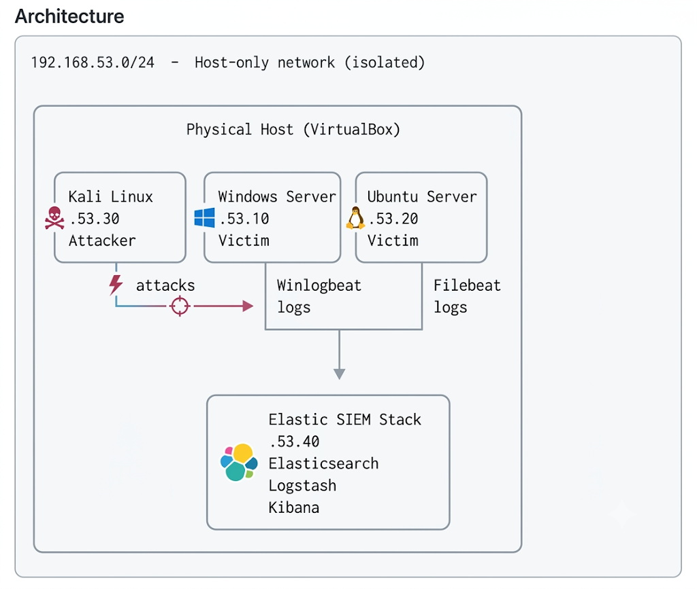

# Home SIEM Lab — Threat Detection with Elastic Stack

## Overview

This project involves designing and deploying a fully isolated 4-VM home lab that ingests logs from victim machines, detects simulated attacks, and fires automated alerts — mirroring the core workflow of a real Security Operations Center (SOC) environment.

The lab was built entirely on consumer hardware using free and open-source tools, with no cloud budget required.

---

## Architecture



## VM Specifications

| VM | OS | IP | Role | RAM | CPUs |
|---|---|---|---|---|---|
| Windows Server | Windows Server 2022 | 192.168.53.10 | Victim | 4 GB | 2 |
| Ubuntu Server | Ubuntu Server 22.04 LTS | 192.168.53.20 | Victim | 2 GB | 1 |
| Kali Linux | Kali Linux (latest) | 192.168.53.30 | Attacker | 2 GB | 2 |
| Elastic SIEM | Ubuntu Server 22.04 LTS | 192.168.53.40 | SIEM | 4 GB | 2 |

---

## Tools and Stack

| Layer | Tool | Purpose |
|---|---|---|
| Hypervisor | VirtualBox | Runs all VMs on the physical host |
| Attacker OS | Kali Linux | Simulates attacks (nmap, Hydra) |
| Log shipper (Windows) | Winlogbeat | Collects and forwards Windows Event Logs |
| Log shipper (Linux) | Filebeat | Collects and forwards auth.log and syslog |
| Log processor | Logstash | Parses, normalises, and routes log data |
| Search and storage | Elasticsearch | Indexes all log data |
| Visualisation and alerting | Kibana | Dashboards, detection rules, and alerts |

---

## What I Built — Step by Step

### Step 1 — Virtual Network

Configured all four VMs on an isolated host-only network (`192.168.53.0/24`) with a secondary NAT adapter for internet access. Each VM was assigned a static IP to ensure consistent log source attribution. The host-only network keeps all attack traffic contained within the lab — no risk of accidentally targeting external systems.

### Step 2 — Log Shippers

Installed **Winlogbeat** on Windows Server to collect Security, System, and Application event logs. Installed **Filebeat** on Ubuntu and Kali to collect `/var/log/auth.log` and `/var/log/syslog`. Both were configured to forward to Logstash on port 5044.

### Step 3 — Elastic SIEM

Deployed Elasticsearch, Logstash, and Kibana on a dedicated Ubuntu VM. Enabled xpack security with HTTPS and configured authentication. Created a Logstash pipeline that receives beats input on port 5044 and indexes into Elasticsearch under a daily `lab-logs-YYYY.MM.DD` index pattern.

### Step 4 — Attack Simulation

Ran the following attacks from the Kali attacker VM:

- **Port scans** using nmap (`-sV`, `-A`, `-sS`, `-p-`) against both victim machines
- **SSH brute force** using Hydra against Ubuntu's SSH service targeting test user accounts
- **SMB brute force** using Hydra against Windows Server targeting local accounts
- **Successful login** from the attacker IP to provide contrast against failed attempts

### Step 5 — Detection and Alerting

Built Kibana dashboards and threshold-based detection rules to identify the simulated attacks.

---

## Dashboards

Four visualisations were created in a single `SIEM Lab — Attack Overview` dashboard:

**Failed logins over time** — bar chart showing failed authentication events over time. The brute force attack appears as a clear spike, making it easy to identify the moment an attack began.

**Top attacking source IPs** — horizontal bar chart of source IPs ranked by failed login count. Immediately identifies `192.168.53.30` (Kali) as the primary threat actor.

**Most targeted usernames** — horizontal bar chart of usernames ranked by failed login attempts. Shows which accounts are being actively enumerated.

**Events by host** — metric visualisation showing event volume per machine. Useful for identifying which systems are under the most pressure.

---

## Detection Rules

### Rule 1 — SSH Brute Force

| Property | Value |
|---|---|
| Type | Threshold |
| Query | `log.file.path: "/var/log/auth.log" AND message: "Failed password"` |
| Threshold | 5 or more events from the same `source.ip` within 1 minute |
| Severity | High |
| Risk score | 75 |

**Threshold reasoning:** Five failures in one minute is very unlikely to be a legitimate user mistyping their password. It represents the minimum signal needed to distinguish brute force from normal failed login noise while avoiding false positives from users who occasionally mistype.

### Rule 2 — Windows Failed Logon Brute Force

| Property | Value |
|---|---|
| Type | Threshold |
| Query | `event.code: "4625"` |
| Threshold | 5 or more events from the same `winlog.event_data.IpAddress` within 1 minute |
| Severity | High |
| Risk score | 70 |

**Threshold reasoning:** Windows Event ID 4625 fires on every failed interactive or network logon. The threshold field was updated to `winlog.event_data.IpAddress` to group directly on the attacker IP as it appears in Windows event data, rather than the ECS-normalised `source.ip` field.

### Rule 3 — Port Scan Detected — Ubuntu

| Property | Value |
|---|---|
| Type | Threshold |
| Query | `event.module: "system" AND event.dataset: "system.syslog" AND message: "*[UFW BLOCK]*"` |
| Threshold | 5 or more events from the same `host.id` within 1 minute |
| Severity | Medium |
| Risk score | 47 |

**Threshold reasoning:** UFW BLOCK entries in syslog indicate the firewall is dropping unsolicited inbound packets. Five or more such events in quick succession from the same host is a reliable indicator of a port scan hitting the Ubuntu victim, while being high enough to filter out occasional background noise.

### Rule 4 — Port Scan Detected — Windows

| Property | Value |
|---|---|
| Type | Threshold |
| Query | `winlog.event_id: "5156" AND winlog.event_data.Direction: "Inbound"` |
| Threshold | 5 or more events from the same `winlog.event_data.SourceAddress` within 1 minute |
| Severity | Medium |
| Risk score | 47 |

**Threshold reasoning:** Windows Filtering Platform event 5156 fires when a connection is permitted by the firewall. Grouping by source address and triggering on five or more inbound connection events in one minute identifies hosts conducting rapid port enumeration against the Windows victim.

---

## Key Problems Solved

These are problems encountered during the build that are not covered in standard tutorials. Solving them required independent research and systematic diagnosis.

### Problem 1 — Field Normalisation

**Issue:** Attacker IP addresses were not populating the standard `source.ip` ECS field. On Windows logs the IP was buried in `winlog.event_data.IpAddress`, and on Ubuntu it was embedded as plain text inside the raw `message` string.

**Impact:** Kibana visualisations grouped by `source.ip` returned no results, and detection rules based on source IP were non-functional.

**Solution:** Added a Logstash filter stage to the pipeline:
- For Windows: used a `mutate` filter to copy `[winlog][event_data][IpAddress]` into `[source][ip]`
- For Ubuntu: used a `grok` filter with the pattern `Failed password for %{USER:user.name} from %{IP:source.ip} port %{NUMBER:source.port} ssh2` to extract the IP from the raw message string

**Lesson:** Raw vendor logs rarely map cleanly to ECS standard fields. In a production environment this normalisation is typically handled by Elastic Agent with integration packages, but understanding how to do it manually with Logstash grok filters is an important foundational skill.

### Problem 2 — HTTPS Migration

**Issue:** Enabling `xpack.security.enabled: true` in Elasticsearch automatically switched the HTTP layer to HTTPS. All existing connections from Kibana and Logstash — configured with `http://` URLs — immediately started refusing connections with `Connection refused` errors.

**Solution:** Updated all three config files to use `https://`:
- `kibana.yml`: updated `elasticsearch.hosts` to `https://` and set `elasticsearch.ssl.verificationMode: none`
- `logstash/beats-input.conf`: updated the output block with `ssl => true` and `ssl_certificate_verification => false`
- Added the `elastic` user credentials to the Logstash output block

**Lesson:** Enabling security in Elasticsearch is not just a config flag — it has cascading effects on every component in the stack. In production, TLS certificates would be properly signed rather than using verification bypass.

### Problem 3 — Bootstrap Password Error

**Issue:** Running `elasticsearch-setup-passwords interactive` returned exit code 78 with the error `Failed to authenticate user 'elastic'`. The standard setup tool failed because the cluster had already auto-initialised its own bootstrap credentials on first start.

**Solution:** Used the newer `elasticsearch-reset-password` tool instead:
```bash
sudo /usr/share/elasticsearch/bin/elasticsearch-reset-password -u elastic -i
sudo /usr/share/elasticsearch/bin/elasticsearch-reset-password -u kibana_system -i
```

**Lesson:** Elastic's documentation for different versions can be inconsistent. The `setup-passwords` tool is deprecated in newer versions of Elasticsearch 8.x in favour of `reset-password`. Always check which version of Elasticsearch is running and use the corresponding tooling.

### Problem 4 — Detection Engine Initialisation

**Issue:** Navigating to Security → Rules returned the error: *"Users with write permission need to access the Elastic Security app to initialize the app source data."*

**Solution:** Manually triggered Security app initialisation via the Kibana API:
```bash
curl -u elastic:password -k -X POST https://192.168.53.40:5601/api/detection_engine/index \
  -H "kbn-xsrf: true" \
  -H "Content-Type: application/json"
```

**Lesson:** The Elastic Security app requires a one-time initialisation step to create its internal data streams (`.siem-signals-*`). This is not clearly documented in the UI error message and requires either an API call or navigating to the Security app as a superuser for the first time.

---

## What I Would Do Differently in Production

- Use **Elastic Agent** instead of individual Beats — it handles field normalisation automatically via integration packages, eliminating the manual Logstash grok work
- Enable **proper TLS certificates** (e.g. via Let's Encrypt or an internal CA) rather than disabling SSL verification
- Store credentials in the **Elasticsearch keystore** rather than plaintext in config files
- Set up **index lifecycle management (ILM)** to automatically roll over and delete old indices — in a real environment logs accumulate quickly
- Implement **account lockout policies** on both victim machines — this lab intentionally left them off to allow brute force simulation, but in production lockout after 5 failures is standard
- Deploy a **dedicated log retention solution** (cold storage, S3 snapshots) for long-term forensic evidence preservation

---

## Repository Structure

```
/
├── README.md                   ← this document
├── configs/
│   ├── logstash-pipeline.conf  ← Logstash beats input and grok filters
│   ├── filebeat.yml            ← Filebeat config (Ubuntu/Kali)
│   └── winlogbeat.yml          ← Winlogbeat config (Windows)
├── rules/
│   └── detection-rules.ndjson  ← Exported Kibana detection rules
├── screenshots/
│   ├── dashboard-overview.png
│   ├── failed-logins-spike.png
│   ├── alerts-firing.png
│   └── rule-configuration.png
└── notes/
    └── troubleshooting.md      ← Detailed troubleshooting notes
```

---

## Skills Demonstrated

- Virtual network design and segmentation
- Log ingestion pipeline configuration (Beats → Logstash → Elasticsearch)
- Log field normalisation using Logstash grok filters and ECS mapping
- Kibana dashboard creation and data visualisation
- Threshold-based detection rule authoring and tuning
- Attack simulation (port scanning, brute force)
- Systematic troubleshooting of distributed system failures
- Security hardening (xpack security, HTTPS, authentication)
